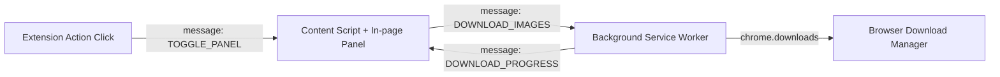

# Gemini Batch Image Downloader Development Guide

## 1. 原理分析

### 1.1 Gemini 图片 URL 结构
Gemini 对话中的生成图片 URL 通常如下所示：
```
https://lh3.googleusercontent.com/gg-dl/AOI_d_-c1p...CwmTQ=s1024-rj
```
- **`gg-dl`**: 关键路径标识，用于区分 Gemini 生成的图片与其他 Google 图片（如头像）。
- **`=s1024-rj`**: 图片处理参数。`s1024` 表示最长边 1024 像素，`rj` 表示可能是 WebP 或 JPEG 转换。
- **全尺寸获取**: 将参数替换为 **`=s0`** 即可获取原始无损 PNG 图片（通常是 1792×2400，约 7MB）。

### 1.2 Cookie 与鉴权
Gemini 图片下载链接需要鉴权（即只有登录用户才能下载）。
- **Service Worker `fetch()`**: 在 Chrome Extension 中，SW 的 fetch 请求不会自动携带当前页面的 Cookie，因此无法直接使用 fetch 下载。
- **`chrome.downloads.download()`**: 此 API 委托浏览器的下载管理器发起请求。它**会自动携带目标域名 (googleusercontent.com) 的所有 Cookie**，等同于用户在浏览器中点击链接。这是本插件的核心技术点。

### 1.3 页面 DOM 结构
图片被包含在 `button.image-button` 容器中。
```html
<div class="overlay-container">
  <button class="image-button">
    
  </button>
  <!-- 隐藏的下载按钮 -->
  <button aria-label="Download full size image">...</button>
</div>
```
Content Script 通过选择器 `button.image-button img[src*="gg-dl"]` 精准定位目标图片。

---

## 2. 架构设计

### 2.1 组件通信


### 2.2 技术栈选择
- **Vite 6**: 构建速度快，生态好。
- **@crxjs/vite-plugin**: 专为 Chrome Extension 开发设计的 Vite 插件，支持 HMR。
  - *注意*: 这是一个关键点，我们不得不降级 Vite 到 v6 以兼容此插件。
- **TypeScript**: 类型安全。

---

## 3. 开发指南

### 3.1 环境准备
```bash
pnpm install
```

### 3.2 开发模式
```bash
pnpm dev
```
此命令会启动 Vite 开发服务器。你需要手动加载 `dist/` 目录到 Chrome。修改代码后，Extension 会自动 reload（HMR）。

### 3.3 生产构建
```bash
pnpm build
```
产出优化后的代码到 `dist/` 目录。

---

## 4. 常见问题 (FAQ)

### Q: 为什么点击图标后页面内面板没出现？
A: Content Script 只有在页面刷新后才会注入。如果是刚安装或更新了插件，请**刷新 Gemini 页面**再点扩展图标。

### Q: 为什么下载的文件名是乱码？
A: 默认情况下，Gemini 图片的文件名是随机字符串。本插件支持自定义前缀（如 `gemini_01.png`），在 Background SW 中处理重命名。

### Q: 为什么构建报错？
A: 如果遇到 `@crxjs/vite-plugin` 相关的导入错误，请检查 `vite.config.ts` 中的导入方式。Vite 7+ 可能存在兼容性问题，目前推荐使用 Vite 6。
